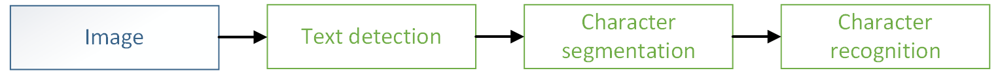
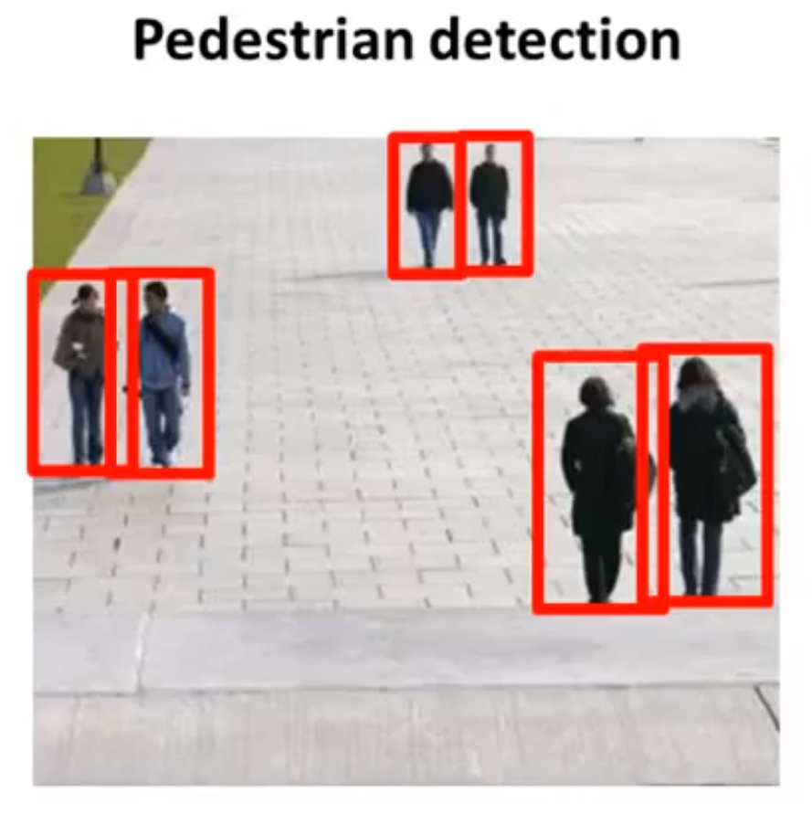
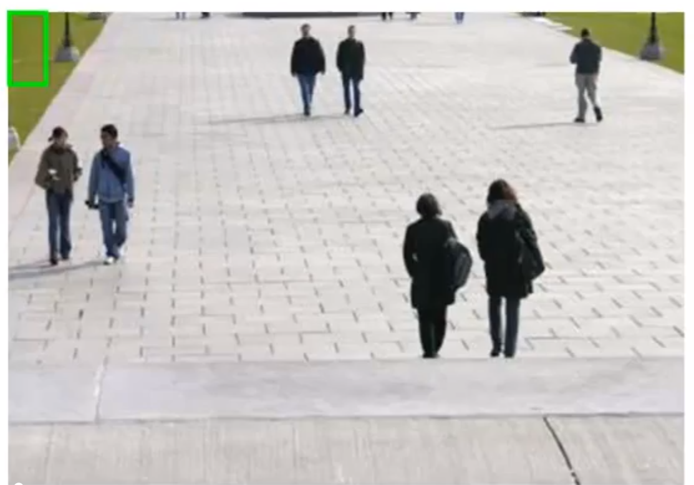
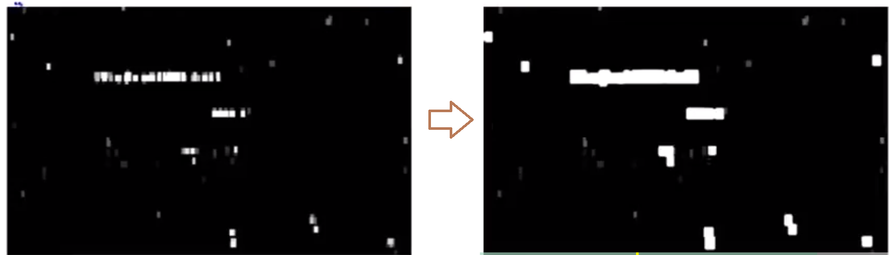

# 照片OCR

tags： OCR Pipeline Artificial_Data_Synthesis Ceiling_Analysis

---
<!-- TOC -->

- [照片OCR](#照片ocr)
    - [1. 简述](#1-简述)
        - [机器学习流水线（machine learning pipeline）](#机器学习流水线machine-learning-pipeline)
    - [2. 详细说明](#2-详细说明)
    - [3. 获取大量的数据](#3-获取大量的数据)
    - [4. 上限分析（Ceiling Analysis）](#4-上限分析ceiling-analysis)

<!-- /TOC -->

---

## 1. 简述  
　　照片OCR表示照片光学字符识别（Photo Optical Character Recognition）。一个有意思的问题是如何让计算机更好地理解照片的内容，比如从照片中识别出拍到的文字信息。照片OCR除了让计算机更好的理解照片，还衍生出了很多的应用，比如让盲人通过照片知道眼前的东西，或者汽车导航系统通过识别交通标识来进行导航。  
　　
### 机器学习流水线（machine learning pipeline）  
　　机器学习流水线是指由多个步骤构成，按前后顺序逐步完成的机器学习系统。比如在照片OCR问题中，一种流水线的形式是：  
  
　　即对图片先进行文字检测（找出图中存在文字的区域），然后进行字符切分（根据文字区域的矩形轮廓将区域内的文字切分为独立的字符），最后进行字符分类（即识别，通过分类器算法识别出每个独立的字符图片对应什么字符）。也许有的流水线还包括拼写矫正等步骤，这里不去讨论。  
　　流水线形式在复杂的机器学习问题中非常普遍。流水线中的各个模块可能都是机器学习组件，也可能某些模块只是一些对数据的处理过程，各个模块按顺序一个一个连接在一起最后得到需要的结果。在设计这样的机器学习系统时，最重要的问题就是如何组织流水线，即如何设计流程，划分和组织模块。  
　　
## 2. 详细说明  
　　在照片OCR流水线中第一步是文字检测，文字检测可以运用滑动窗口（sliding windows）的方法。首先先看一个行人检测的例子。  
  
　　相比于文字检测来说，行人检测相对简单，因为大部分的行人都比较相似，可以用固定宽高比的矩形来分离出行人。  
　　- 定义长宽比例82:36（或者80:40等等）的矩形  
　　- 收集正负样本，也用同样比例的矩形表示，有行人的为正样本（y=1），没有的为负样本（y=0）  
　　- 训练一个神经网络或者什么其他的监督学习算法来进行分类，分为有行人和没行人两类  
　　- 对于新的图片，通过滑动窗口的方法获取小块图片运用训练好的分类器，判断小块中是否有行人：对图片取一小块同比例长方形作为窗口，用分类器进行辨别，之后将这个长方形区域向右滑动，再截取一块长方形进行运算，如此直到所有整个图像都分析完毕。之后再放大窗口，按上面的步骤继续将图像分析完毕。注意用窗口截取图片时，如果大于训练分类器使用的图像大小，则需要按比例进行压缩在进行分类。用更大的窗口分析图像，按这样的步骤，就可以判断出图片中行人的位置。  
  
　　有行人检测作为参照，文本检测的过程类似，收集带字母的图片作为正样本，不带字母的图片作为负样本，训练出分类器，然后再用滑动窗口方法对图片进行分析，找到有字母的区域。由于滑动窗口的机制，标记出的有字母的区域可能是连续的方块形式，而实际需要的应该是一个连续的矩形区域，这里就需要展开器（expansion operator），将看起来不是很连续的字母区域扩展为一整个矩形区域。  
  
　　扩展完成后，根据一些实际情况或者经验（比如实际一串文字大多数是比较宽而不是高）去除图中一些不合理的标记，然后将剩下的标记为文字的区域取出准备进行下一步的字符切分。  
  
　　字符切分的大致步骤是：通过神经网络等监督算法进行训练，训练内容是找一些两个字符间的样本作为正样本，单独字符的样本作为负样本，训练结果得出分类器来判断图中表示的是不是两个字符之间（当然正负样本都是同大小矩形图片）。然后通过滑动窗口方法对上一步中判断为有文字的区域进行判断，从窗口中获取图片放到分类器中进行判断，如果是两个字符中间则可以将两个字符分开，否则继续判断下一个窗口的内容。通过这样的方式就可以将字符进行分割。  
　　  
　　字符切分完成后就需要对字符进行识别。通过监督学习算法训练一个字符的分类器，用分类器对每个字符图片进行识别分类即可。  

## 3. 获取大量的数据  
　　想要获取大量的数据来训练算法的话，有一种想法叫做人工数据合成（artificial data synthesis）。这个概念不针对某一具体的问题，但是思想可以应用到很多问题中。人工数据合成通常包含两种变体，一种是创造数据，另一种是基于已有的少量标签过的训练集进行扩充。  
　　先说创造数据，用照片OCR的字母识别来举例。可以从计算机中或者网上的一些自字体库中提取不同的字体，然后将单独的字符放入一个固定的正方形或长方形区域内，之后再为其添加随机的背景，最后对图像做一些模糊（变形）操作，比如均匀、等比缩放、旋转等，这样就可以得到很多的人工合成的样本。当然在这个过程中需要仔细的考虑，需要让人工合成的数据尽可能的像真实的数据，否则用一些不太合实际的样本进行训练可能达不到好的效果。  
　　再说使用已有样本进行扩充的方式。这种方式是基于已有的真实的样本，对这些样本进行变形来生成新的样本。比如还是字母识别，在已有的字母样本基础上，对样本进行不同程度的扭曲和变形，就能得到很多新的样本。当然这个过程也是需要仔细考虑的，对当前的样本来说什么样的变形才是合理的，不同的应用场景可能需要不一样的方式。比如另外的语音识别的例子，可以选择在原有的干净的语音中添加不同的背景声音来扩充样本。需要说明的一点是，如果采用对样本进行变形或者干扰的方式来扩充样本，那么可能代表着在测试集中确实可能存在类似的情况，比如在干净的语音中添加随机的噪声，在实际中并不太可能遇到这样的情况，所以这种做法可能不太有意义。  
　　  
　　在获取大量的数据之前，需要有一些前提或者准备。首先算法应该是一个低偏差的算法，其次可以思考一个问题：需要多少工作量来获取10倍于现有数据量的数据。获取数据的方法有很多，比如人工数据合成、自己收集标记或者众包（crowd sourcing）等等，然后计算一下需要多少时间。可能几天或者几个星期时间就可以收集到数据，就可以让算法有比较大的提高。  
　　  
## 4. 上限分析（Ceiling Analysis）  
　　上限分析是用来判断在整个机器学习流水线中哪一部分更值得花时间来优化，哪一部分的优化更有价值，避免在其他地方消耗时间却得不到收益。  
　　比如使用照片OCR的例子来说明一下上限分析。在照片OCR中，比如定义字符准确度作为整个系统的一个数值评价量度。系统由上述三部分组成：文字检测、字符切分和字符分类。假设当前整个系统的准确度为72%。在保证文字检测的准确率为100%（比如人工识别出所有有文字的地方来保证其准确率）的情况下，将数据走完整个系统，此时整个系统的准确率会有提升，比如为89%。然后继续保证文字检测和字符切分的准确率都为100%，继续让数据走完整个系统，准确率会提升至比如90%。最后保证三个步骤的准确率都为100%，那么整个系统的准确率自然也为100%。于是有了如下的一个表格：  

| 系统步骤 | 准确率 |  
|----------|--------:|  
|整个系统  |72%     |  
|文字检测  |89%     |  
|字符切分  |90%     |  
|字符分类  |100%    |  

　　这个表格说明了，如果有完美的文字检测，那么系统准确率可以提升17%，有完美的字符切分可以提升1%，有完美的字符分类可以提升10%。那么就可以看出，文字检测和字符分类更具有上升潜力，值得花时间去优化。至于实际是否真的要去改善，需要结合实际情况来评估，但至少能够看到一些方向。  
　　上面只是一个例子，在实际的工作中，希望可以通过上限分析来分析系统在哪些方面更有潜力，来针对的进行优化，而不是仅仅通过直觉来感觉。  

