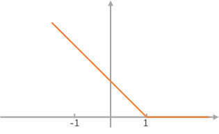
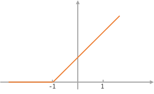
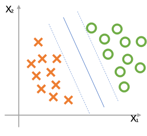

# Support Vector Machine（SVM）

tags： SVM Supervised_Learning

---
<!-- TOC -->

- [Support Vector Machine（SVM）](#support-vector-machinesvm)
    - [1. 假设函数](#1-假设函数)
    - [2. 高斯核函数（Gaussian Kernels）](#2-高斯核函数gaussian-kernels)
    - [3. 具体使用](#3-具体使用)
        - [多分类问题](#多分类问题)
        - [逻辑回归还是SVM](#逻辑回归还是svm)

<!-- /TOC -->

---

## 1. 假设函数  
　　SVM为学习复杂的非线性方程提供了一种更为清晰、更加强大的方式。SVM仅支持二分类问题。  
　　假设函数：  
$$\large min_\theta C  \sum^m_{i=1}[y^{i}cost_1(\theta^T x^{(i)}) + (1-y^{(i)})cost_0(\theta^T x^{(i)})] + \frac 1 2\sum^n_{i=1}\theta^2_j$$  
　　其中$cost_1(z)和cost_0(z)$分别代表的函数图像如下：  
    
 
 　　SVM又被称为Large Margin Classifier，原因在于其在进行分类时拥有决策边界（Decision Boundary），当参数C取合适值时，算法能更好的对分类进行划分。  
   
    另外较大的参数C可能造成低偏差高方差，而较小的C参数则可能造成高偏差低方差。  
  
## 2. 高斯核函数（Gaussian Kernels）  
　　用于使SVM处理非线性分类问题。  
　　相似度函数如下：  
$$\large f_i = similarity(x, l^{(i)}) = exp(- \frac {\|x-l^{(i)}\|^2} {2\sigma^2})$$  
　　当$x与l^{(i)}$比较接近时，有$\|x-l^{(i)}\|^2 \approx 0 \to f_i \approx exp(- \frac 0 {2\sigma^2}) \approx 1$，反之有$f_i \approx 0$。  
　　当$\theta_0 + \theta_1f_1 + \theta_2f_2 + \cdots + \theta_nf_n \geq0$时预测$y = 1$，实际意义在于选定$l^{(1)}，l^{(2)}\cdots l^{(n)}$这n个点，当距离这些点距离近时则预测1。  
　　$sigma^2$参数的影响：越大则函数表现越平滑，算法高偏差低方差；越小则函数表现越陡峭，算法低偏差高方差。  
　　  
　　将之与SVM结合起来：  
　　- 对于所有训练集$(x^{(1)},y^{(1)}),(x^{(2)},y^{(2)}),\cdots ,(x^{(m)},y^{(m)})$  
　　- 选择所有点作为指定点，即令$l^{(1)} = x^{(1)}, l^{(2)} = x^{(2)}, \cdots , l^{(m)} = x^{(m)}$  
　　- 取训练集中一个点与其他点计算相似度，即$f_i^{(i)} = similarity(x^{(i)}, l^{(i)})$，其中该点与自己的相似度为1，把所有计算结果作为向量，有$f^{(i)} = \begin{bmatrix}  
                f_0^{(i)} \\\\  
                f_1^{(i)} \\\\   
                \vdots \\\\  
                f_m^{(i)}\end{bmatrix}$，其中$f_0^{(i)} = 1$，此时$f^{(i)} \in \mathbb{R}^{m+1}$  
　　- 于是转变为了当$\theta^T f \geq 0$时预测y=1的问题  
　　- 训练SVM：  
$$ min_\theta C  \sum^m_{i=1}[y^{i}cost_1(\theta^T f^{(i)}) + (1-y^{(i)})cost_0(\theta^T f^{(i)})] + \frac 1 2\sum^m_{i=1}\theta^2_j$$  

## 3. 具体使用  
　　在实际使用算法时建议使用已有的库（如liblinear,libsvm等）。需要做的是：  
　　- 选择C参数  
　　- 选择核函数  
　　不使用核函数也意味着使用线性核函数(linear kernel)，比如特征值数量很多且训练集样本很少时，可以选择线性核函数，避免由于样本很少而过度拟合一个复杂的核函数。  
　　如果特征值数量较少且训练集样本很多时，可以选择高斯核函数。选择高斯核函数时，需要决定参数$\sigma^2$。有的库包含高斯核函数，有的需要自己来实现。在使用核函数之前，需要对特征值做特征缩放（feature scaling）。  
　　当然也有其他可以选择的核函数，但并不是所有的核函数都能用在SVM中，可以使用的核函数需要满足莫塞尔定理（Mercer's Theorem）。其他的核函数有：  
　　- 多项式核函数（Polynomial kernel）$k(x,l) = (x^Tl+constant)^{degree}$  
　　- 字符串核函数（String kernel）  
　　- 卡方核函数（chi-square kernel）  
　　- 直方图交叉核函数（histogram intersection kernel）  
  
### 多分类问题  
　　如果相关库有多分类函数，直接使用即可；如果自己来实现，一种可行的方式是使用一对多（one-vs.-all）方法，即需要区分K个分类，建立K个SVM，每一个SVM把一个分类和其他分类区别开，得到K个θ，在预测时用那个θ计算出的结果最大就是哪个类别的。  
　　
### 逻辑回归还是SVM  
　　用n代表特征值数量，用m代表训练集样本数：  
　　- 如果n很大，且远大于m（比如n=10000，m=10\~1000），选择逻辑回归或者使用线性核函数的SVM  
　　- 如果n很小，m中等（比如n=1\~1000， m=10\~10000），选择使用高斯核函数的SVM  
　　- 如果n很小，m很大（比如n=1\~1000，m=50000+），需要添加更多的特征值，然后使用逻辑回归或者使用线性核函数的SVM（高斯核函数在m大时会比较慢）  
　　- 神经网络一般来说对于上述问题都可以使用，问题是有的时候会很慢，好的SVM实现包可能会运行的比神经网络快很多。  
