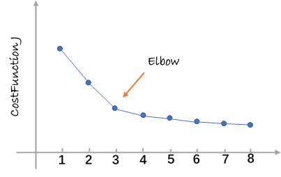

# Clustering 集群

tags： Unsupervised_Learning K_means

---
<!-- TOC -->

- [Clustering 集群](#clustering-集群)
    - [1. K均值算法（K-means）定义](#1-k均值算法k-means定义)
    - [2. 代价函数](#2-代价函数)
    - [3. 初始化方法](#3-初始化方法)
    - [4. 选择聚类数目K](#4-选择聚类数目k)
        - [肘部法则（Elbow Method）](#肘部法则elbow-method)

<!-- /TOC -->

---
## 1. K均值算法（K-means）定义  
　　K均值算法是一个迭代算法，通过迭代对数据集进行划分。算法主要包含两个部分，一个是簇（cluster）的划分，另一个是移动聚类中心。具体说明如下：  
　　算法接受两个参数：  
　　- 希望聚类出的簇的数量K  
　　- 训练集$\{x^{(1)},x^{(2)}\cdots x^{(m)}\}$    ($x^{(i)}\in\mathbb{R}^n$ ,这里不需要x_0=1这一项)  
　　算法执行过程：  
　　随机初始化K个聚类中心$\mu_1,\mu_2\cdots \mu_K \in \mathbb{R}^n$  
　　Repeat {  
　　　　for i = 1 to m  
　　　　　　$c^{(i)}$:=最接近$x^{(i)}$的是第几个聚类中心（取值从1到K）（实际上是计算$min_k\|x^{(i)}-\mu_k\|^2$，即表示$x^{(i)}$属于哪一个聚类中心）  
　　　　for k = 1 to K  
　　　　　　$\mu_k$:=属于该聚类中心的所有点的平均值，即在划分簇后计算中心点作为新的聚类中心  
　　}  
  
　　上述过程中如果有一聚类中心一直没有点分配给它，则可以移除该聚类中心，但是这样最后的分类结果会比预期的少。如果依然想得到K个分类，则需要重新随机定义聚类中心后再进行运算。  
　　另外K均值算法往往也运行在没有明确划分的数据集中，比如在服装中定义S/M/L等几种大小型号，而不同人的身高体重等数据在合并在一起后可能并没有明显的分界。  

## 2. 代价函数  
　　如下：  
$$\large J(c^{(1)},\cdots ,c^{(m)},\mu_1,\cdots,\mu_K) = \frac 1 m \sum^m_{i=1}\|x^{(i)}-\mu_{c^{(i)}}\|^2$$  
　　其中$\mu_{c^{(i)}}$是指分配给$x^{(i)}$的聚类中心。  
　　实际上K均值算法的执行过程就是在不断最小化上述代价函数，正确执行过程中代价函数的值应该不断减小，可以根据这一点来验证算法是否正常运行。  
　　
## 3. 初始化方法  
　　K均值算法中开始的K个聚类中心的初始化过程可能是这样的：  
　　首先取得K值要小于训练集的样本数量m，否则没有任何意义；  
　　其次随机从样本中选取K个样本，然后令聚类中心指向这些样本，这样完成了聚类中心的初始化。  
　　注意，随机选择的聚类中心不同可能造成不同的计算结果，因此为了避免得到的仅仅是一个局部最优解，需要多次（一般为50~1000次）随机选择聚类中心并执行算法，保证可以得到一个可以接受的局部最优或者全局最优解。  
　　  
## 4. 选择聚类数目K  
　　这个问题没有非常标准的解答或者能自动解决它的方法，目前用来决定聚类数目的最常用的方法仍然是通过看可视化的图或者看聚类算法的输出结果，或者其他一些东西来手动地决定聚类的数目。  
### 肘部法则（Elbow Method）  
　　按照从1开始逐渐增大的方式选择K，分别执行算法并计算代价函数的值，可能得到如下的图像：  
  
　　图中K=3处开始发现代价函数的畸变程度明显开始变缓，说明K=3可能是个比较好的选择。  
　　肘部法则可以尝试，但是不能期待它一定能给出一个好的结果，有的时候会发现从图像中并不能明显的看到elbow的存在。实际分类中另一种可以使用的方式是根据实际问题来定。比如根据市场生产S/M/L三种型号的衣服可以满足客户或者需要三种型号的衣服，那么选择K=3就可以了。  
