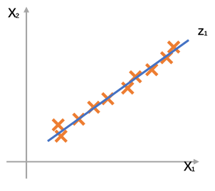
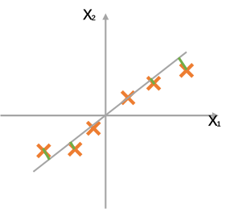

# 主成分分析 Principal Component Analysis

tags： PCA Unsupervised_Learning

---
<!-- TOC -->

- [主成分分析 Principal Component Analysis](#主成分分析-principal-component-analysis)
    - [1. 维数约减（Dimensionality Reduction）](#1-维数约减dimensionality-reduction)
    - [2. 主成分分析法（Principal Component Analysis）](#2-主成分分析法principal-component-analysis)
        - [具体算法(n维->k维)](#具体算法n维-k维)
        - [数据重构(Reconstruction)](#数据重构reconstruction)
        - [选择k的值](#选择k的值)
        - [使用PCA加速监督算法](#使用pca加速监督算法)
        - [PCA算法的应用](#pca算法的应用)

<!-- /TOC -->

---

## 1. 维数约减（Dimensionality Reduction）  
　　使用维数约减的原因一方面是数据压缩，减少对计算机内存和硬盘的占用，另一方面是减少算法特征值的维度，加快算法执行。  
  
 　　如图所示，$x_1和x_2$两个特征值大体上呈直线排列，由于测量或者取整等可能有一些误差，但大致呈直线，这样就可以用一条直线来拟合这两个特征值，两个特征值就可以用$z_1$来代替。  
 　　另外，维数约减也可以用来可视化数据，即对数据减维之后使之能够可视化，方便更好的理解数据。  
 
## 2. 主成分分析法（Principal Component Analysis）   
　　PCA做的主要是找到一个低维的面，使得每个数据距离该面的投影距离最小。换一个说法，是在n维数据中，找到一个n维向量，使得所有数据的投影误差最小。这是1维的情况，更多的时候是n到k维的转换，则需要找k个n维向量来使得投影误差最小。  
  
　　可能看起来PCA和线性回归有点像，但实际上两者还是不同的算法，PCA需要的是投影误差最小，而线性回归需要的是点与拟合直线之间的平方误差最小。除此之外，线性回归中有y这个特别的变量，而PCA中是不需要的。  
　　  
### 具体算法(n维->k维)  
　　- 训练集$x^{(1)},x^{(2)},\cdots,x^{(m)}$  
　　- 数据预处理（特征缩放/均值归一化）：  
　　　　　计算平均值$\mu_j = \frac 1 m \sum^m_{i=1}x_j^{(i)}$  
　　　　　用$x_j-\mu_j$替换$x_j^{(i)}$，或者如果数值范围差别较大，则用$\frac {x_j-\mu_j} {s_j}$，$s_j$表示特征j的标准差  
　　- 计算协方差矩阵（covariance matrix）：$\Sigma = \frac 1 m \sum^n_{i=1}(x^{(i)})(x^{(i)})^T ,\ \ \Sigma \in \mathbb{R}^{n\times n}$  
　　- 计算矩阵$\Sigma$的特征向量(eigenvectors)：[U, S, V] = svd(Sigma)  ，Octave中svd表示奇异值分解(singular value decomposition)函数，这里也可以用eig函数  
　　- 取计算结果中的U矩阵：$U = \begin{bmatrix} | & | & & |\\\\ u^{(1)} & u^{(2)} & \cdots & u^{(n)} \\\\ | & | & & |\end{bmatrix} \in \Bbb{R}^{n \times n}$，取前k个值作为新矩阵：$U_{reduce} = \begin{bmatrix}| & | & & |\\\\ u^{(1)} & u^{(2)} & \cdots & u^{(k)} \\\\ | & | & & | \end{bmatrix}$  
　　- 计算k维空间的矩阵：$z^{(i)} = U_{reduce}^T x^{(i)}$，其中$U_{reduce}^T \in \Bbb{R^{k\times n}}，x^{(i)} \in \Bbb{R^{n\times1}}，则z^{(i)} \in \Bbb{R^{k\times1}}$  

### 数据重构(Reconstruction)  
　　从上面的算法可以完成从n维到k维的计算，那么如何从k维恢复到n维数据呢？由上部分算法的最后一步可以推算出：$x_{approx}^{(i)} = U_{reduce}z^{(i)}$，得到原本n维向量的近似值。  
　　  
### 选择k的值  
　　这里有两个概念：  
　　平均平方映射误差（Average Squared Projection Error）：即当前维度数据与低维度映射数据之间的距离的平方的平均值，使该值最小即PCA算法的目的；  
　　总变差（Total Variance）：所有训练样本长度的平方的均值。  
　　一个常见的选择k的经验法则是选择平均平方映射误差和总变差之间比例小于等于0.01的最小的k值，即  
$$\frac {\frac 1 m \sum^m_{i=1}\|x^{(i)} - x_{approx}^{(i)}\|^2} {\frac 1 m \|x^{(i)}\|^2} \leq 0.01$$  
　　右侧这个0.01表示保留了99%的差异性，另一个常用的值时0.05，即保留了95%的差异性。  
　　根据上述经验法则，一个简单的思路是从k=1开始试用PCA算法，并在最后计算平均平方映射误差与总变差的比例，如果小于等于0.01则选择k=1，否则继续计算k=2，直至得到满足条件的k值。但是这个过程中多次计算PCA，会消耗较多的资源。于是有另一种计算方式：  
　　在计算[U, S, V] = svd(Sigma)这一步时，S矩阵是一个$n\times n$方阵，只有$s_{11},s_{22},\cdots,s_{nn}$有值，之后上面的比例式可以用如下算法替代：  
$$\frac {\frac 1 m \sum^m_{i=1}\|x^{(i)} - x_{approx}^{(i)}\|^2} {\frac 1 m \|x^{(i)}\|^2} \leq 0.01 \Rightarrow 1-\frac {\sum^k_{i=1}s_{ii}}{\sum^n_{i=1}s_{ii}} \leq 0.01$$  
　　这样就可以只使用一次svd函数，然后从k=1开始计算上述公式的值，直至得到一个满足该条件的k值。  
　　另一方面，通过计算上述结果可以作为PCA算法结果的一种描述方式，比如保留了多少的差异性。  
　　  
### 使用PCA加速监督算法  
　　对于训练集$(x^{(1)},y^{(1)}),(x^{(2)},y^{(2)}),\cdots,(x^{(m)},y^{(m)})$，抽取未标记的集合$x^{(1)},x^{(2)},\cdots,x^{(m)}\in \Bbb{R}^n$，通过PCA算法得到降维后的集合$z^{(1)},z^{(2)},\cdots,z^{(m)}\in \Bbb{R}^k$，再结合y集合组成新的训练集$(z^{(1)},y^{(1)}),(z^{(2)},y^{(2)}),\cdots,(z^{(m)},y^{(m)})$。  
　　需要注意的是，PCA算法仅在训练集上执行，在得到映射关系后再将映射关系应用到交叉验证集和测试集上。  
　　
### PCA算法的应用  
　　如前面在维数约减中提到的，PCA可以用来减少计算机存储空间以及加速算法运行，另一方面也可以帮助数据的可视化（降维到2~3维）。另外，使用PCA来避免过拟合不是一种好的方法，因为在使用PCA时即使保留99%的差异性也依然有一些有用的信息被舍弃掉了，如果需要避免过拟合，使用正则化的效果要好的多。  
　　在实际考虑算法的时候，需要明确PCA的实际作用是什么，在没有确定这一点建议先不要把PCA考虑进算法中，直接使用原始数据进行运算。如果实际遇到比如算法收敛很慢，占用内存或者硬盘空间很大等问题，有充足的理由时再来考虑使用PCA算法。  
